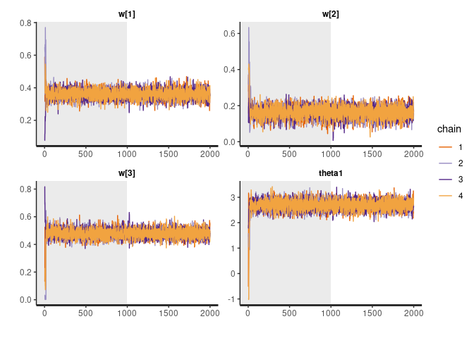
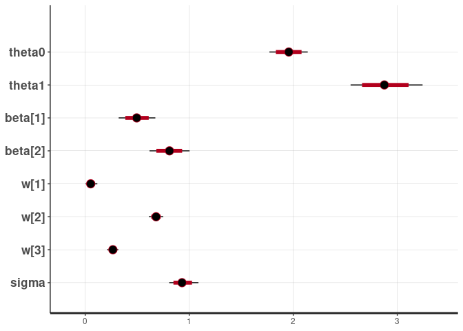

<!-- README.md is generated from README.Rmd. Please edit that file -->

# bws

<!-- badges: start -->
<!-- badges: end -->

The goal of bws is to provide a user-friendly and efficient
implementation of the Bayesian Weighted Sums (BWS) described by Hamra,
Maclehose, Croen, Kauffman, and Newschaffer (2021) with some extensions
to work with binary and count response data.

## Installation

You can install the development version from
[GitHub](https://github.com/) with:

``` r
# install.packages("devtools")
devtools::install_github("phuchonguyen/bws")
```

## Example

This is a basic example which shows you how to fit BWS:

``` r
## We first need to simulate some data
set.seed(123)
N <- 100
P <- 3
K <- 2
X <- matrix(rnorm(N*P), N, P)
Z <- matrix(rnorm(N*K), N, K)  # confounders
w <- c(0.3, 0.2, 0.5)
theta0 <- 2
theta1 <- 3
beta <- runif(K, 0.5, 1.5)
y <- theta0 + theta1*theta1*(X%*%w) + Z%*%beta + rnorm(N)
## Fitting BWS is simple
fit <- bws::bws(iter = 2000, y = y, X = X, Z = Z,
         # additional arguments for rstan::sampling
         chains = 4, cores = 2, show_messages = FALSE)
#> Warning: replacing previous import 'lifecycle::last_warnings' by
#> 'rlang::last_warnings' when loading 'tibble'
#> Warning: replacing previous import 'lifecycle::last_warnings' by
#> 'rlang::last_warnings' when loading 'pillar'
```

Since the implementation uses Stan and returns an `rstanfit` object,
users can enjoy all the functionalities provided in `rstan` to analyze
the fitted model:

``` r
rstan::traceplot(fit, pars = c("w", "theta1"), inc_warmup = TRUE, nrow = 2)
```



``` r
print(fit, pars = c("w", "theta1"))
#> Inference for Stan model: bws.
#> 4 chains, each with iter=2000; warmup=1000; thin=1; 
#> post-warmup draws per chain=1000, total post-warmup draws=4000.
#> 
#>        mean se_mean   sd 2.5%  25%  50%  75% 97.5% n_eff Rhat
#> w[1]   0.32       0 0.01 0.30 0.31 0.32 0.33  0.34  5292    1
#> w[2]   0.19       0 0.01 0.17 0.18 0.19 0.19  0.21  5750    1
#> w[3]   0.49       0 0.01 0.47 0.49 0.49 0.50  0.51  6125    1
#> theta1 8.71       0 0.19 8.34 8.59 8.71 8.84  9.08  5388    1
#> 
#> Samples were drawn using NUTS(diag_e) at Sat Jun 11 17:51:41 2022.
#> For each parameter, n_eff is a crude measure of effective sample size,
#> and Rhat is the potential scale reduction factor on split chains (at 
#> convergence, Rhat=1).
rstan::plot(fit)
#> ci_level: 0.8 (80% intervals)
#> outer_level: 0.95 (95% intervals)
```



The model inferred the correct weights, which are set to 0.3, 0.2, 0.5
in the simulation.

## Reference:

Hamra, G.B.; Maclehose, R.F.; Croen, L.; Kauffman, E.M.; Newschaffer, C.
Bayesian Weighted Sums: A Flexible Approach to Estimate Summed Mixture
Effects. *Int. J. Environ. Res. Public Health* **2021**, *18*, 1373.
<https://doi.org/10.3390/ijerph18041373>
